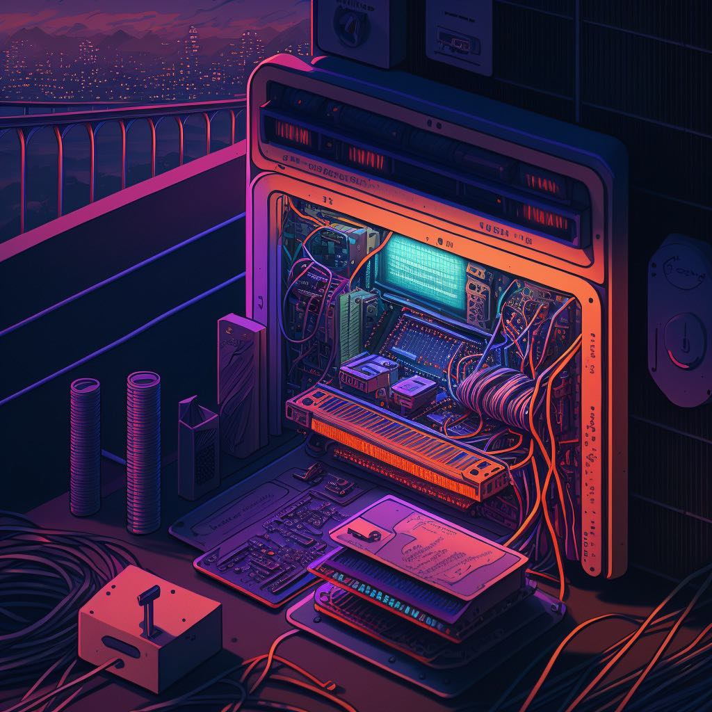

<!--Banner-->
<div align="center">
  
  
  ### Hi there, I'm Yasar Nazzarian 👋
  ### Software Engineering Student
  ## Follow me on social media👇
</div>

<!--Social media links-->
<div align="center">
  <a href="https://ca.linkedin.com/in/yasarnazzarian-98"></a>
  <a href="https://www.twitter.com/yasarnazarian/"></a>
  <a href="https://www.instagram.com/yasar.nazarian/"></a>
 
   <br/> <br/>
 
</div>

---


<!--START_SECTION:waka-->

```rust
From: 06 July 2022 - To: 01 November 2023

Total Time: 159 hrs 52 mins

Python        54 hrs 19 mins  >>>>>>>>-----------------   32.08 %
Java          35 hrs 53 mins  >>>>>--------------------   21.19 %
C             24 hrs 41 mins  >>>>---------------------   14.58 %
TypeScript    15 hrs 23 mins  >>-----------------------   09.09 %
Other         9 hrs 26 mins   >------------------------   05.58 %
```

<!--END_SECTION:waka-->

<!--### Recent Activity

```text
Python     1 hr 37 mins    ███████████████████▓░░░░░   79.30 %
Other      11 mins         ██▒░░░░░░░░░░░░░░░░░░░░░░    9.22 %
Markdown   6 mins          █▒░░░░░░░░░░░░░░░░░░░░░░░    5.50 %
Git        6 mins          █▒░░░░░░░░░░░░░░░░░░░░░░░    5.01 %
XML        1 min           ▒░░░░░░░░░░░░░░░░░░░░░░░░    0.97 %
```-->
<!--
[](https://github.com/gazf/github-readme-twitter) 
 -->
<a href="https://app.daily.dev/yas1998"></a>

If you are wondering about this digital card, this is the DevCard from [daily.dev](https://daily.dev/)<br />
You can also download the daily.dev extension from this [link](https://api.daily.dev/get?_ga=2.119423488.800246194.1657125023-620882592.1657125023)

<!--
**Yasar2019/Yasar2019** is a ✨ _special_ ✨ repository because its `README.md` (this file) appears on your GitHub profile.

Here are some ideas to get you started:

- 🔭 I’m currently working on ...
- 🌱 I’m currently learning ...
- 👯 I’m looking to collaborate on ...
- 🤔 I’m looking for help with ...
- 💬 Ask me about ...
- 📫 How to reach me: ...
- 😄 Pronouns: ...
- ⚡ Fun fact: ...
-->
