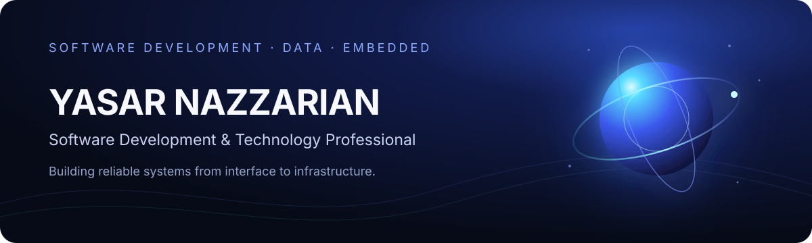

<div align="center">
  
</div>

<h1 align="center">Software Development &amp; Technology Professional</h1>
<p align="center">Full-stack development · Data solutions · Embedded systems · Applied AI</p>

<div align="center">

[](https://yasar2019.github.io/MyResume/)
[](https://ca.linkedin.com/in/yasarnazzarian-98)
[](mailto:yasar20111926@hotmail.com)


</div>

## About me

I'm a **Software Development & Technology Professional** in Montréal, combining software engineering studies with hands-on experience building practical digital solutions.

My work spans full-stack applications, data-driven tools, embedded systems, and business technology. I enjoy turning complex requirements into software that is clear, maintainable, and useful to the people who depend on it.

- Building web applications and data products with modern JavaScript and TypeScript
- Developing microservices and connected-device solutions
- Creating business applications and dashboards with Microsoft Power Platform
- Exploring practical AI, automation, and developer tooling
- Open to internships, collaborative projects, and open-source contributions

## 🎯 Current Focus

```text
Build dependable products  →  Make data useful  →  Connect software with the physical world
```

- **Product development:** responsive applications, APIs, and intuitive interfaces
- **Data solutions:** transformation, visualization, reporting, and decision support
- **Connected systems:** ESP32 modules, IoT data collection, and real-time workflows
- **Applied AI:** practical tools that improve development and knowledge-sharing

## Selected Projects

| Project | What it demonstrates | Technologies |
| --- | --- | --- |
| [**myPortfolio**](https://github.com/Yasar2019/myPortfolio) | A personal portfolio presenting projects, experience, and technical capabilities through a modern web experience. | Web development, UI/UX |
| [**AI Coding Best Practices**](https://github.com/Yasar2019/AI-Coding-BestPractices) | A structured resource for using AI responsibly and effectively across the software-development lifecycle. | AI-assisted development, documentation |
| [**ETF Pulse Analytics**](https://github.com/Yasar2019/etf-pulse-analytics) | An analytics project for exploring ETFs, portfolio composition, risk, and diversification. | TypeScript, data visualization |

## Technology Toolkit

**Languages**


**Application & Platform Development**


**Data, Embedded & Developer Tools**


## GitHub Activity

<div align="center">

[](https://github.com/Yasar2019?tab=followers)
[](https://github.com/Yasar2019?tab=repositories)

<br /><br />


</div>

## Coding Activity

<!--START_SECTION:waka-->

```rust
From: 06 July 2022 - To: 21 September 2026

Total Time: 223 hrs 11 mins

Python                     82 hrs 8 mins         >>>>>>>>>----------------   34.90 %
Java                       35 hrs 53 mins        >>>>---------------------   15.25 %
C                          24 hrs 41 mins        >>>----------------------   10.49 %
JavaScript                 20 hrs 12 mins        >>-----------------------   08.58 %
TypeScript                 17 hrs 39 mins        >>-----------------------   07.50 %
Other                      12 hrs 11 mins        >------------------------   05.18 %
```

<!--END_SECTION:waka-->

---

<div align="center">
  <strong>Interested in building something useful together?</strong><br />
  <a href="mailto:yasar20111926@hotmail.com">Send me an email</a> ·
  <a href="https://ca.linkedin.com/in/yasarnazzarian-98">Connect on LinkedIn</a> ·
  <a href="https://yasar2019.github.io/MyResume/">View my portfolio</a>
</div>
